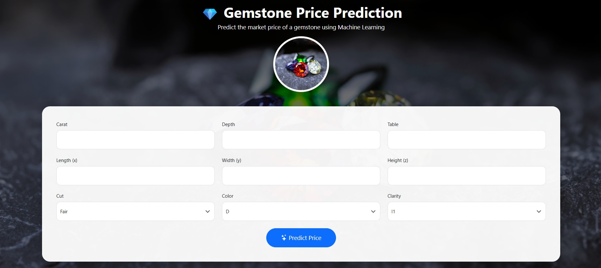
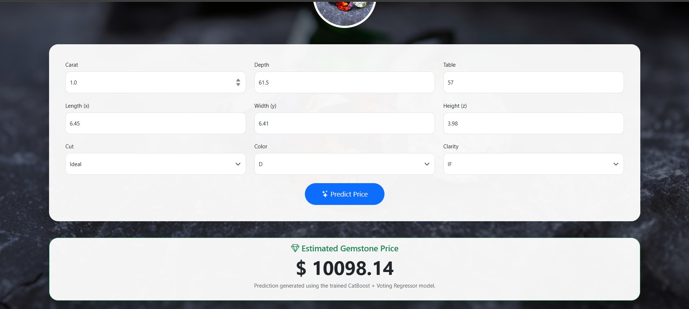

## End to End machine learning project

# 💎 Gemstone Price Prediction using Machine Learning

<p align="center">
  
  
  
  
  
  
</p>

## 📌 Overview

Gemstone Price Prediction is an end-to-end Machine Learning web application that predicts the market price of a gemstone based on its physical and quality characteristics.

The application combines data preprocessing, machine learning, and a Flask web interface to deliver real-time predictions through an intuitive and responsive UI.

---

## 🚀 Live Demo

**Application**

https://machine-learning-project-1-43zd.onrender.com/predict

---

## 📸 Screenshots

### Home Page


```
images/Homepage.jpg
```

---

### Prediction Result


```
images/result.png
```

---

## ✨ Features

- End-to-End Machine Learning Pipeline
- Interactive Flask Web Application
- Responsive Bootstrap UI
- Real-Time Price Prediction
- Data Preprocessing Pipeline
- Model Serialization using Pickle
- REST API Endpoint
- Cloud Deployment on Render

---

## 📊 Dataset Features

| Feature | Description |
|----------|-------------|
| Carat | Weight of the diamond |
| Depth | Total depth percentage |
| Table | Width of the top facet |
| x | Length (mm) |
| y | Width (mm) |
| z | Height (mm) |
| Cut | Diamond Cut Quality |
| Color | Diamond Color Grade |
| Clarity | Diamond Clarity |

Target Variable:

```
Price
```

---

# 🛠 Tech Stack

## Frontend

- HTML5
- CSS3
- Bootstrap 5
- Bootstrap Icons

## Backend

- Flask
- Flask-CORS

## Machine Learning

- Scikit-Learn
- CatBoost
- XGBoost
- Voting Regressor

## Data Processing

- Pandas
- NumPy

## Deployment

- Render
- Gunicorn

---

# 🧠 Machine Learning Workflow

```
Dataset
     │
     ▼
Data Cleaning
     │
     ▼
Feature Engineering
     │
     ▼
Preprocessing Pipeline
     │
     ▼
Model Training
     │
     ▼
Model Comparison
     │
     ▼
Best Model Selection
     │
     ▼
Pickle Serialization
     │
     ▼
Flask Application
     │
     ▼
Live Prediction
```

---

# 📈 Models Compared

- Linear Regression
- Lasso Regression
- Ridge Regression
- K-Nearest Neighbors
- Decision Tree Regressor
- Random Forest Regressor
- Gradient Boosting Regressor
- AdaBoost Regressor
- XGBoost Regressor
- CatBoost Regressor

---

# 🏆 Best Performing Model

| Metric | Value |
|---------|-------|
| Best Model | Voting Regressor |
| Base Models | CatBoost + XGBoost + KNN |
| Test R² Score | **0.9766** |
| RMSE | 631.68 |
| MAE | 345.81 |

---

# 📂 Project Structure

```text
Machine-Learning-Project/
│
├── artifacts/
│   ├── model.pkl
│   └── preprocessor.pkl
│
├── notebooks/
│
├── src/
│   ├── components/
│   ├── pipeline/
│   ├── utils.py
│   └── exception.py
│
├── static/
│   ├── css/
│   └── images/
│
├── templates/
│   └── index.html
│
├── application.py
├── requirements.txt
├── Procfile
├── setup.py
└── README.md
```

---

# ⚙️ Installation

Clone the repository

```bash
git clone https://github.com/YOUR_USERNAME/Machine-Learning-Project.git
```

Move into the project

```bash
cd Machine-Learning-Project
```

Create virtual environment

```bash
python -m venv venv
```

Activate environment

Windows

```bash
venv\Scripts\activate
```

Linux / macOS

```bash
source venv/bin/activate
```

Install dependencies

```bash
pip install -r requirements.txt
```

Run the application

```bash
python application.py
```

Open

```
http://127.0.0.1:8000/predict
```

---

# 🌐 Deployment

This application is deployed using **Render**.

### Build Command

```bash
pip install -r requirements.txt
```

### Start Command

```bash
gunicorn application:app
```

---

# 🔌 REST API

Endpoint

```
POST /predictAPI
```

Example JSON

```json
{
    "carat":1.0,
    "depth":61.5,
    "table":57,
    "x":6.45,
    "y":6.41,
    "z":3.98,
    "cut":"Ideal",
    "color":"D",
    "clarity":"IF"
}
```

Example Response

```json
{
    "price":10234.87
}
```

---

# 📖 Future Improvements

- User Authentication
- Price Trend Visualization
- Batch Prediction using CSV
- Docker Support
- CI/CD Pipeline
- Explainable AI using SHAP
- Cloud Storage Integration
- Model Monitoring

---

# 👨‍💻 Author

**Dhanush Kumar**

GitHub

https://github.com/dhanush947

LinkedIn

https://www.linkedin.com/in/dhanush-kumar-k-032199261/

---

# ⭐ Support

If you found this project useful, consider giving it a ⭐ on GitHub.